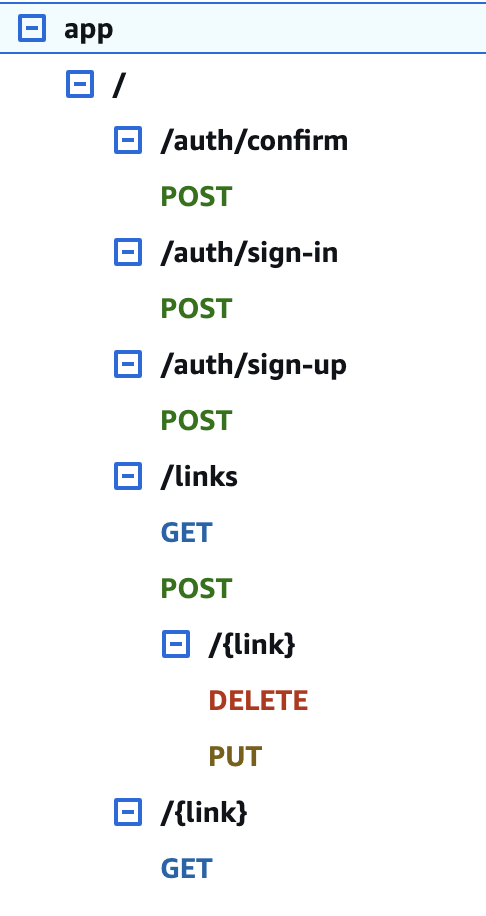

# Compute-free URL Shortener

This project is a **compute-free URL shortener**, meant as a fun experiment to explore the capabilities of AWS
services without relying on traditional server-side compute resources like Lambda functions or EC2 instances. The
architecture is built entirely on managed AWS services, focusing on minimal operational overhead, scalability, and cost
efficiency.

## Features

- **No Compute**: All operations, including creating, editing, deleting, and redirecting URLs, are handled directly via
  API Gateway and DynamoDB, with no custom backend code.
- **User Authentication**: Cognito User Pools secure access to the API, ensuring only authenticated users can create or
  manage their links.
- **Scalable Data Store**: DynamoDB powers the storage and retrieval of URL mappings, including a global secondary
  index (GSI) for efficient querying by user.
- **RESTful API**: Exposes a clean and simple API for interacting with the system, fully defined in this CloudFormation
  template.
- **Redirects**: Supports redirection for short URLs with HTTP 301 responses, configurable at the root of the API.

**NB**: this CloudFormation does not offer a Cognito sign-in/sign-up experience, it was a bit out of scope of this
project. We'll create a user manually later.

## Project Structure

```
├── app
│   ├── deploy.sh         # Script for deploying the CloudFormation stack
│   └── template.yaml     # CloudFormation template defining the infrastructure
```

## Getting Started

### Prerequisites

- [AWS CLI](https://aws.amazon.com/cli/) installed and configured with appropriate credentials.
- [SAM CLI](https://docs.aws.amazon.com/serverless-application-model/latest/developerguide/what-is-sam.html) (optional,
  for easier deployment).
- Basic knowledge of AWS CloudFormation and API Gateway.

### Deployment

1. Clone this repository:
   ```bash
   git clone https://github.com/kit-g/url-shortener.git
   cd url-shortener/app
   ```

2. Config
    - EITHER:
    ```shell
    cd app
    touch samconfig.toml
    ```
   and then populate it like this
    ```toml
    version = 0.1
    [default]
    [default.deploy]
    [default.deploy.parameters]
    stack_name = "url-shortener"
    s3_bucket = "..." # TODO your SAM bucket name
    s3_prefix = "url-shortener"
    region = "ca-central-1" # TODO your AWS region
    parameter_overrides = """
        DomainName=\"<maybe your custom DNS name>\"
        SslCertificate=\"<the SSL certificate ARN in ACM>\"
    """
    confirm_changeset = true
    capabilities = "CAPABILITY_IAM"
    ```
   and then
    ```shell
    ./deploy.sh default # or your correct AWS profile
    ```

    - OR
    ```shell
    cd app
    sam build
    sam deploy --guided 
    ```
   and it will walk you through the TOML setup manually.


3. Note the outputs from the deployment process, including:
    - Cognito User Pool ID
    - Cognito User Pool Client ID
    - API Gateway ID

### API Endpoints

The API has the following structure


- `/links` resource is authenticated with Cognito and allows full CRUD on links.
- `/{link}` redirect resource is public.

### Usage

1. First, we'll manually create a Cognito user to test.
    - AWS Cognito console -> Users -> Create User
    - Create a user and take note of the password. Don't forget to add email to that user, because we use it as the
      user's key. Our API will break without it.
    - Then, using values our SAM deployment script returned:
      ```shell
      aws cognito-idp admin-initiate-auth \
      --user-pool-id <user-pool-id> \
      --client-id <user-pool-client-id> \
      --auth-flow ADMIN_NO_SRP_AUTH \
      --auth-parameters USERNAME="<username>",PASSWORD="<password>"```

    - this will probably tell you that you need to reset your password. You can do it with (grab the `Session` value
      from previous command)
      ```shell
      aws cognito-idp admin-respond-to-auth-challenge \
      --user-pool-id <user-pool-id> \
      --client-id <user-pool-client-id> \
      --challenge-name NEW_PASSWORD_REQUIRED \
      --challenge-responses USERNAME="<username>",NEW_PASSWORD="<password>" \
      --session "<session>"
      ```

    - this should return a bunch of tokens. We need `IdToken`. If it expires, you can fetch a new one with the previous
      script.

    - **NB**: this is by no means a proper way to set up Cognito with a project, but it works for our little app

    - time to test:
    ```shell
      API_URL="https://<api_id>.execute-api.<region>.amazonaws.com/app/links" 
      AUTH_TOKEN="<id_token>" 
      REQUEST_BODY='{
          "id" :"cats",
          "url": "https://www.youtube.com/results?search_query=cat+videos"
      }' 
         
      curl -X POST "$API_URL" \
        -H "Content-Type: application/json" \
        -H "Authorization: Bearer $AUTH_TOKEN" \
        -d "$REQUEST_BODY"
    ```
   If everything is correct, you should see something like:
    ```
    {
      "id": "cats", --our link id
      "url": "https://www.youtube.com/results?search_query=cat+videos",
      "timestamp": "20/Jan/2025:01:08:27 +0000",
      "owner": "user@mail.com"
    }
    ```

   Now if you paste `https://<api_id>.execute-api.<region>.amazonaws.com/app/cats` into the browser, it should take you
   to your link.

No compute at all, not a single Lambda!
